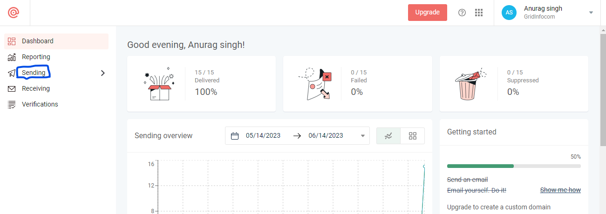
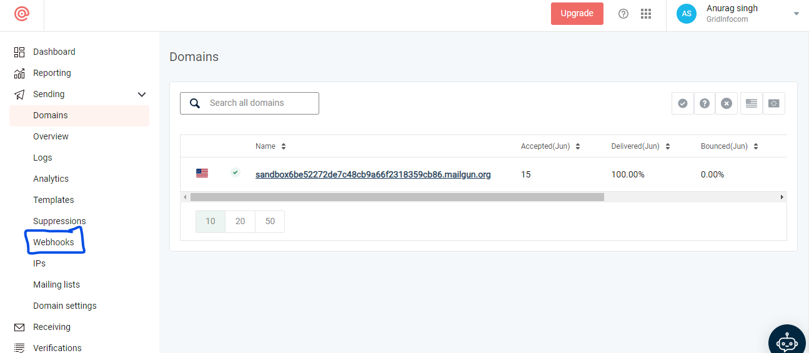
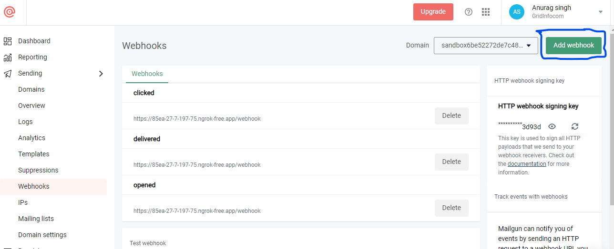
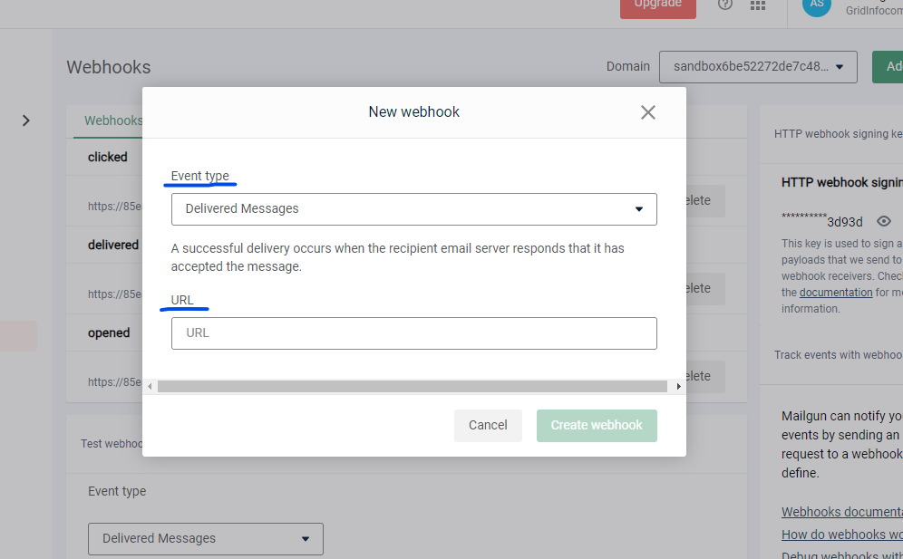

## To configure Mailgun webhook to receive status callbacks, follow these steps:

### Create a webhook endpoint:
```
Set up a server or an endpoint on your server to receive the webhook callbacks from Mailgun. Make sure the endpoint is publicly accessible and can handle incoming HTTP requests.
```
### Configure the webhook settings in Mailgun:

```
Log in to your Mailgun account.
```
```
Go to the Mailgun dashboard.
```
```
Click on the "Sending" tab in the navigation menu.
```

```
Scroll down and click on the "Webhooks" tab.
```

```
Click on "Add New Webhook".
```

```
Select the types of events you want to receive notifications for (e.g., delivered, opened, clicked, bounced, etc.).
```
```
In the "URL" field, enter the URL of your webhook endpoint.
```

```
Click the "Save" or "Create Webhook" button to apply the changes.
```
## Handle incoming webhook events:
```
Implement the logic on your server to handle incoming webhook events from Mailgun. Parse the JSON payload sent by Mailgun and extract the relevant information such as event type, recipient, message ID, etc. Here's an example of how you can handle the webhook events:

// HandleMailgunWebhook is the HTTP handler for receiving Mailgun webhook events
func HandleMailgunWebhook(w http.ResponseWriter, r *http.Request) {
    // Verify the request authenticity if signed webhook events are enabled
    if isValid := verifyWebhookSignature(r); !isValid {
        w.WriteHeader(http.StatusUnauthorized)
        return
    }

    // Parse the JSON payload
    var payload map[string]interface{}
    if err := json.NewDecoder(r.Body).Decode(&payload); err != nil {
        // Handle parsing error
        w.WriteHeader(http.StatusBadRequest)
        return
    }

    // Extract the relevant information from the payload
    event := payload["event"].(string)
    recipient := payload["recipient"].(string)
    messageID := payload["message-id"].(string)

    // Process the webhook event based on the event type
    switch event {
        case "delivered":
            // Handle delivered event
            // Update your internal database or send notifications
        case "opened":
            // Handle opened event
            // Update your internal database or send notifications
        case "clicked":
            // Handle clicked event
            // Update your internal database or send notifications
        case "bounced":
            // Handle bounced event
            // Update your internal database or send notifications
        // Add more cases for other event types you want to handle
        default:
            // Ignore or log unrecognized event types
            return
    }

    // Return a successful response
    w.WriteHeader(http.StatusOK)
}

// Verify the webhook event signature (if enabled) to ensure authenticity
func verifyWebhookSignature(r *http.Request) bool {
    // Implement the verification logic using the provided signature
    // and the Mailgun API key or other credentials
    // Return true if the signature is valid, false otherwise
}
```
```
You can modify the HandleMailgunWebhook function to fit your application's requirements.
```

## Process the webhook events:

```
Once you receive the webhook events and validate their authenticity (if enabled), you can process them according to your application's needs. Update your internal database with the delivery status, send notifications, or perform other actions based on the event type.
```

```
By following these steps, you will be able to configure Mailgun to send webhook callbacks to your specified endpoint, allowing you to receive and process status updates for your sent emails.
```